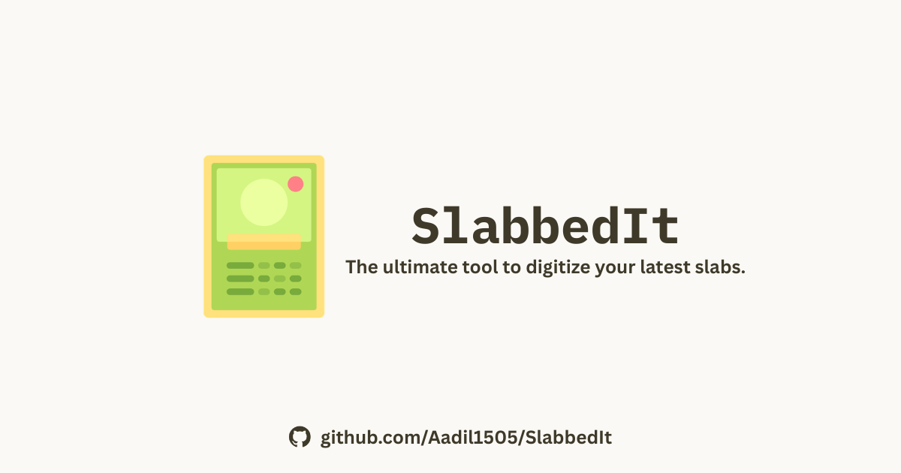

<div align="center">



# SlabbedIt

**Preview your trading card sealed in a graded PSA-style slab — before you pay to submit it.**

Drop in a card, pick a grade and label details, and get a photorealistic graded-slab
render you can admire, screenshot, and share. The entire slab — acrylic case, bevel,
gloss, floor shadow, protective bumper, printed label — is built in **pure CSS/DOM**,
no canvas or WebGL, so it stays razor-sharp at any size and renders instantly.

</div>

---

## Features

- 🃏 **Bring your own card** — search the [TCGdex](https://tcgdex.dev) catalog or upload a photo of your own (read locally, never uploaded).
- 🏷️ **Editable grade label** — PSA-style grade scale, card name, set, year, number, and cert; auto-filled from the catalog and fully editable.
- 🛡️ **Configurable bumper** — color presets or a custom picker, thickness, corner radius, matte/gloss finish, and translucent "frosted" materials.
- ✨ **Live material realism** — cursor-driven tilt, gloss tracking, and directional acrylic reflections.
- 🖼️ **One-click export** — download or copy a 4× PNG that matches the studio view, including its material lighting and stage.
- 🌗 **Light & dark themes** — a warm-paper light mode and a dark "gallery stage" (the default).

## Tech stack

- [Next.js 16](https://nextjs.org) (App Router) + [React 19](https://react.dev)
- [Tailwind CSS v4](https://tailwindcss.com) with a token-driven theme (`app/globals.css`)
- [shadcn/ui](https://ui.shadcn.com) primitives
- [TCGdex SDK](https://tcgdex.dev) for card data and imagery
- [modern-screenshot](https://github.com/qq15725/modern-screenshot) for DOM-to-PNG export
- Pure CSS/DOM slab rendering — no canvas, no 3D

## Getting started

```bash
# install (Bun is the primary package manager; npm/pnpm/yarn also work)
bun install

# run the dev server
bun dev
```

Open [http://localhost:3000](http://localhost:3000).

| Script        | Description                  |
| ------------- | ---------------------------- |
| `bun dev`     | Start the dev server         |
| `bun run dev:https` | Start the dev server with a locally trusted HTTPS certificate |
| `bun run build` | Production build           |
| `bun start`   | Serve the production build   |
| `bun run lint`  | Lint with ESLint           |

Image clipboard writes require a secure browser context. They work on a deployed
HTTPS site and on trusted local HTTPS. For testing from a physical phone, the
development certificate authority must also be trusted by that device. On an
insecure LAN `http://` address, **Copy** downloads the same PNG instead.

## How it works

The slab is a representational CSS model. Every dimension is expressed in
container-query units (`cqw`) relative to the slab's width, so the whole case scales
as one piece from a thumbnail to a full-screen hero. The case reads as clear plastic
from layered hard edges, rails, and directional reflections rather than an opaque
fill. Export composites the same stage DOM to a high-resolution PNG via
`modern-screenshot`. The captured stage owns its background and uses export-safe
material layers, so the live preview and PNG keep the same contrast and color.

```
app/                Next.js App Router (layout, page, metadata routes, icons)
components/
  slab-studio.tsx   The studio: controls + export
  psa-slab.tsx      The pure-CSS slab and printed label
  slab-bumper.tsx   The protective bumper wrapper
  card-search.tsx   TCGdex catalog search
  site-header.tsx   Navbar
  site-footer.tsx   Footer
  ui/               shadcn/ui primitives
lib/                tcgdex client, cursor tilt, helpers
```

## Roadmap

See [`TODO.md`](./TODO.md) for deferred work (reduced-motion fallback, analytics,
optional cutout export, and product-scope decisions).

## Disclaimer

SlabbedIt is an independent fan project. It is **not affiliated with, endorsed by, or
sponsored by PSA** (Professional Sports Authenticator) or any grading company. Slab
images, labels, grades, and certificate numbers are illustrative only — they are
**not** authentication or official grading results.

## Acknowledgements

Card data and imagery courtesy of [TCGdex](https://tcgdex.dev).
